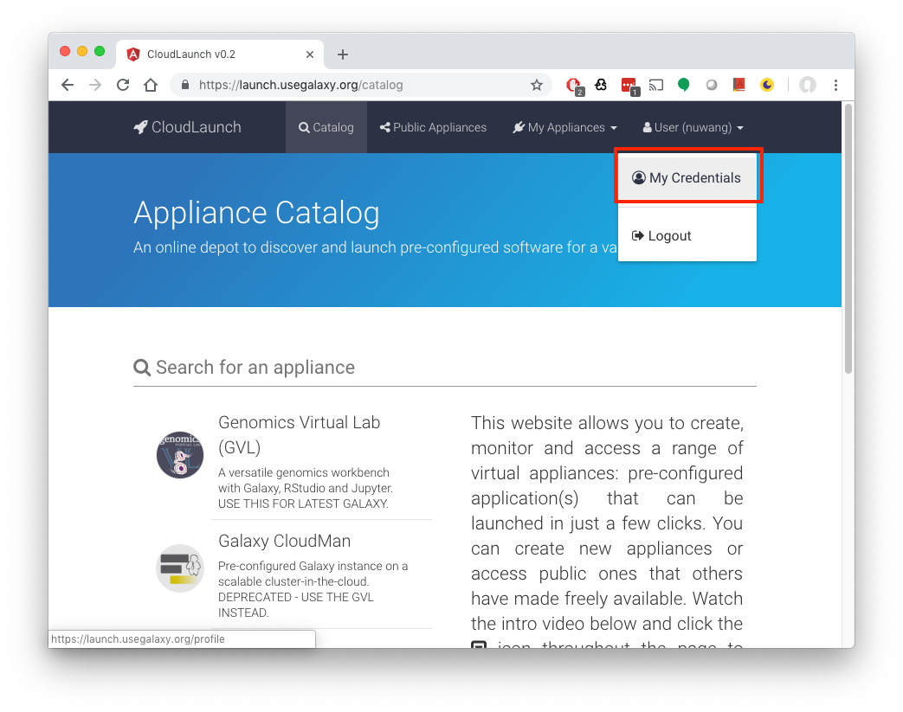
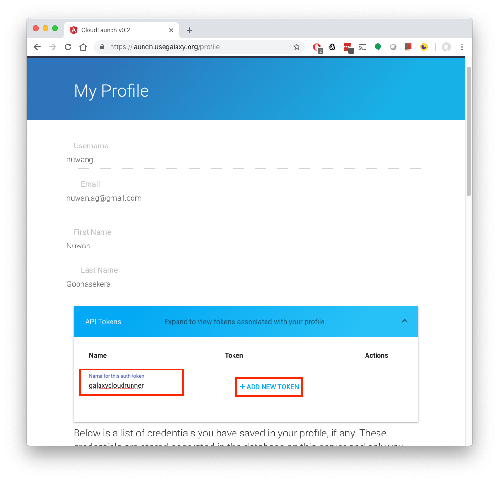
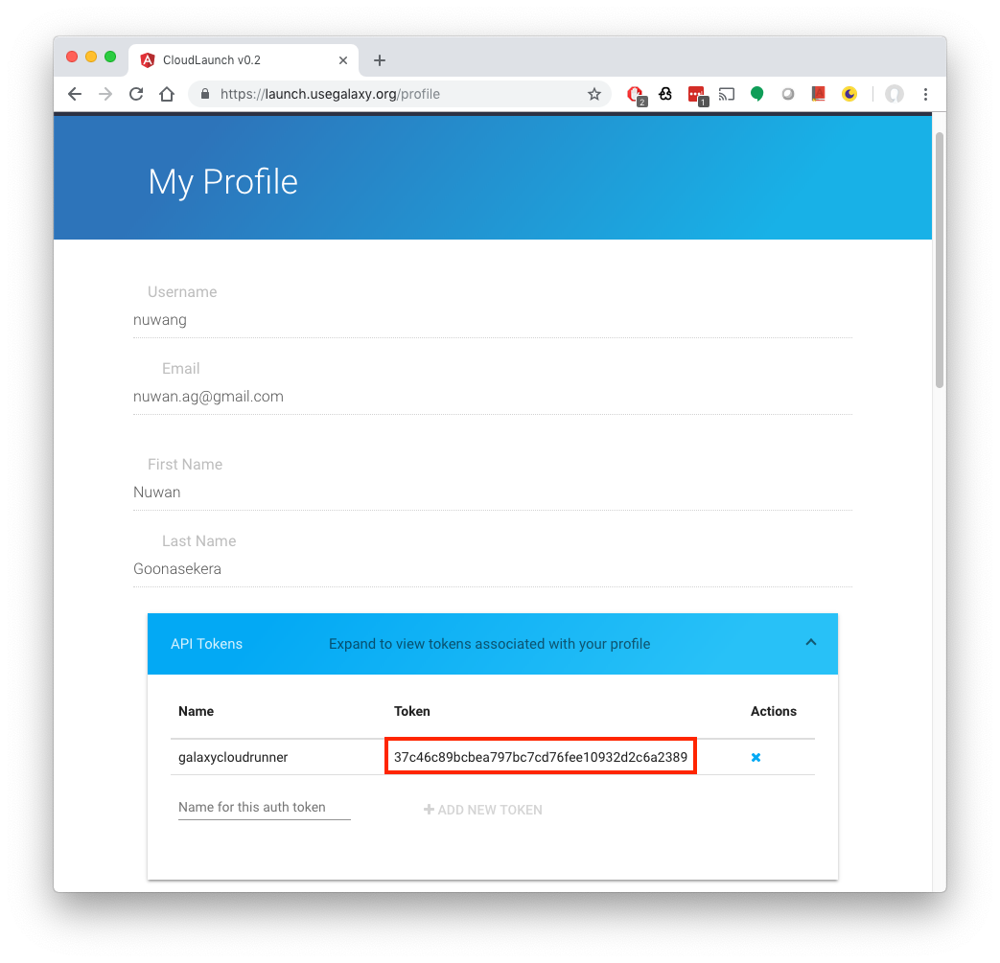
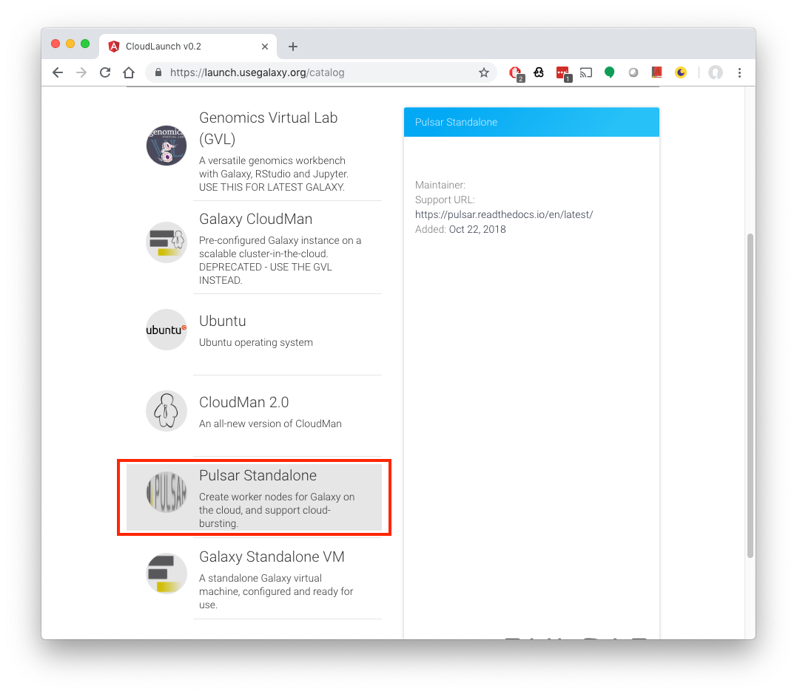
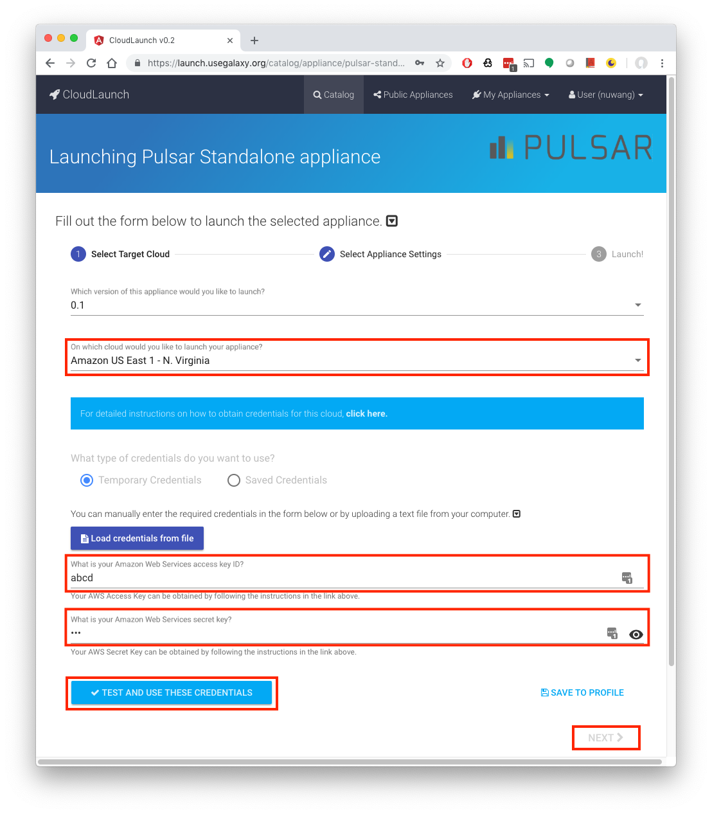
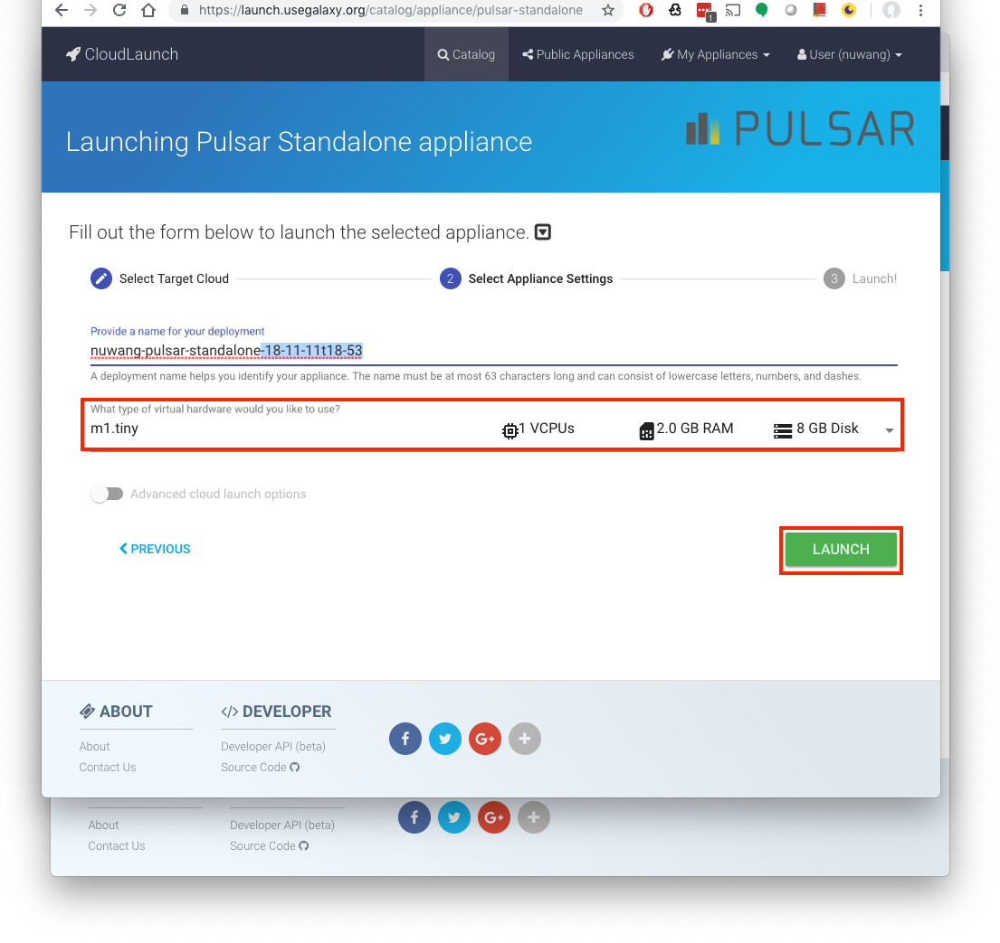

Configuring Galaxy
------------------
1. First install the GalaxyCloudRunner into your Galaxy virtual environment.

.. code-block:: shell

    source .venv/bin/activate
    pip install galaxycloudrunner

2. If you have Galaxy v19.01 or higher, you can skip this step. For prior
   versions, you will need to add a GalaxyCloudRunner
   job rule to your Galaxy configuration by pasting the following file contents
   into your Galaxy job rules folder in:
   `<galaxy_home>/lib/galaxy/jobs/rules/`.

   Create a file named galaxycloudrunner.py and paste the following contents
   into the file at the location above.

.. literalinclude:: ../../galaxycloudrunner/rules/cloudlaunch_pulsar.py
   :language: python
   :linenos:

3. Edit your job_conf.xml in the `<galaxy_home>/config` folder and add the
   highlighted sections to it.

   You will need to add your own ``cloudlaunch_api_token`` to the file.
   Instructions on how to obtain your CloudLaunch API key are given below.
   If you have a Galaxy version prior to 19.01, the line
   `<param id="rules_module">galaxycloudrunner.rules</param>` passed to your
   destination will not work. This is the reason that we need to perform step 2.

.. literalinclude:: ../samples/job_conf.xml.basic
   :language: xml
   :linenos:
   :emphasize-lines: 7,9-20

4. Launch as many Pulsar nodes as you need through `CloudLaunch`_. The job rule
   will periodically query CloudLaunch, discover these new nodes, and route jobs
   to them.
   Instructions on how to launch new Pulsar nodes are below.

5. Submit your jobs as usual.

Obtaining a CloudLaunch API key
-------------------------------
1. Visit the CloudLaunch site: `https://launch.usegalaxy.org/`_
2. Select Login on the top menu bar and sign in through a social network
   provider.
3. Once logged in, select the 'My Profile' option from the menu bar as shown.

4. Get a new API token for CloudLaunch by expanding the collapsed panel.
   You can give it any name you like (we have given ``galaxycloudrunner``) and
   click the `Add New Token` button.

5. Copy the token value and paste it into your job_conf.xml

Adding new Pulsar nodes
-----------------------

1. To launch a new Pulsar node, go to `https://launch.usegalaxy.org/`_
2. Select the ``Pulsar Standalone`` appliance.

3. You may be asked to login through a social network provider.
4. Once logged in, fill in the following fields:

   a. The target cloud you want to launch in
   b. Your credentials for the cloud.
   c. Click the 'Test and use these Credentials button' to validate them.
   d. Click next

5. Finally, select the size of the Virtual Machine you want, and click Launch.

6. Simply launching the node is enough, the GalaxyCloudRunner will now pick up
   your new nodes by querying the CloudLaunch API.

Simple configuration
--------------------

The following is a simple job configuration sample that you can use to get
started.

.. literalinclude:: ../samples/job_conf.xml.basic
   :language: xml
   :linenos:
   :emphasize-lines: 7,9-18

In this simple configuration, all jobs are routed to GalaxyCloudRunner by 
default. This works as follows:

1. If a Pulsar node is available, it will return that node.
2. If multiple Pulsar nodes are available, they will be returned in a
   round-robin loop.
3. You can add or remove Pulsar nodes at any time. However, there's a caching
   period (currently 5 minutes) to avoid repeatedly querying the server, that
   will result in a short period of time before the change is detected by
   the GalaxyCloudRunner. This has implications for node addition and in
   particular removal. When adding a node, there could be a delay of a few
   minutes before the node is picked up. If a Pulsar node is removed, your jobs
   may be routed to a dead node for the duration of the caching period. See
   :ref:`additional-configuration` on how to change this cache period.
4. If no node is available, it will return the ``fallback_destination_id``, if
   specified, in which case the job will be routed there. If no
   ``fallback_destination_id`` is specified, the job will be re-queued till a node
   becomes available.

To burst or not to burst?
-------------------------

In the above example, all jobs are routed to the GalaxyCloudRunner by default.
However, it is often the case that jobs should be routed to the remote cloud
nodes only if the local queue is full. To support this scenario, we recommend
a configuration like the following.

.. literalinclude:: ../samples/job_conf.xml.burst_if_queued
   :language: xml
   :linenos:
   :emphasize-lines: 8,10-16

Note the emphasized lines. In this example, we route to the built-in rule
``burst`` first, which determines whether or not the cloud bursting
should occur. It examines how many jobs in the
``from_destinations`` are in the given state (``queued`` in this case),
and if they are above ``num_jobs``, routes to the
``galaxy_cloud_runner`` destination. If bursting should not occur, it routes
to the first destination in the ``from_destinations`` list. This provides a
simple method to scale to Pulsar nodes only if a desired queue has a backlog
of jobs. You may need to experiment with these values to find ones that work
best for your requirements.

Advanced bursting
-----------------

In this final example, we show how a complex chain of rules can be used to
exert fine-grained control over the job routing process.

.. literalinclude:: ../samples/job_conf.xml.burst_if_size
   :language: xml
   :linenos:
   :emphasize-lines: 17-24

Jobs are first routed to the built-in ``burst`` rule, which determines whether the
bursting should occur. If it should, it is then routed to the ``burst_if_size``
destination, which will check the total size of the input files. If they are
less than 1GB, they are routed to the GalaxyCloudRunner. If not, they are
routed to a local queue.

.. _additional-configuration:

Additional Configuration and Limitations
----------------------------------------

1. Configuring the query timeout
   You can set the environment variable ``CLOUDLAUNCH_QUERY_CACHE_PERIOD`` before
   starting Galaxy to control the caching period. Setting this to 0 will allow you
   to get around the node removal issue (If a Pulsar node is removed, your jobs
   may be routed to a dead node for the duration of the caching period.), but we
   recommend setting a value to avoid repeatedly querying a remote server during
   each job submission.

2. Auto-scaling
   Currently, the GalaxyCloudRunner does not support automatic scaling, you must
   manually add and remove nodes. We will be adding autoscaling features as
   part of CloudMan v2.0 in future.

3. Galaxy versions prior to 19.01
   Galaxy versions prior to 19.01 do not support certain features required by
   GalaxyCloudRunner and therefore, need more complex configuration steps.

.. _https://launch.usegalaxy.org/: https://launch.usegalaxy.org/
.. _CloudLaunch: https://launch.usegalaxy.org/